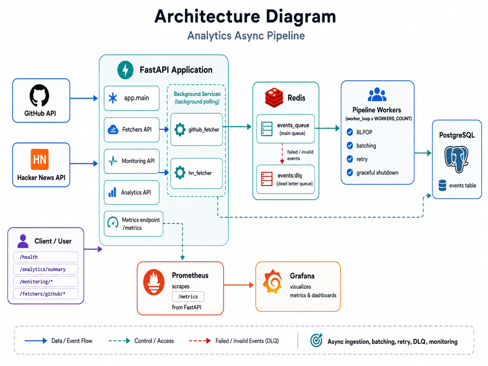
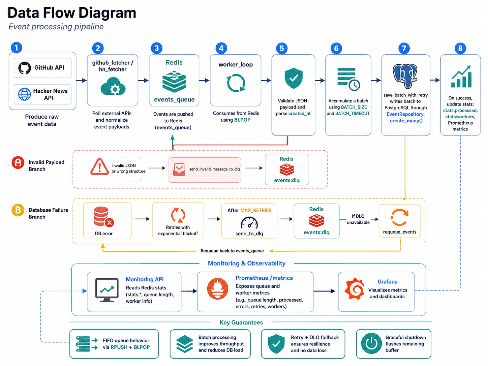
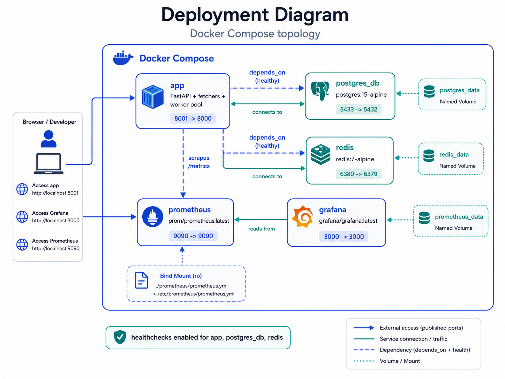
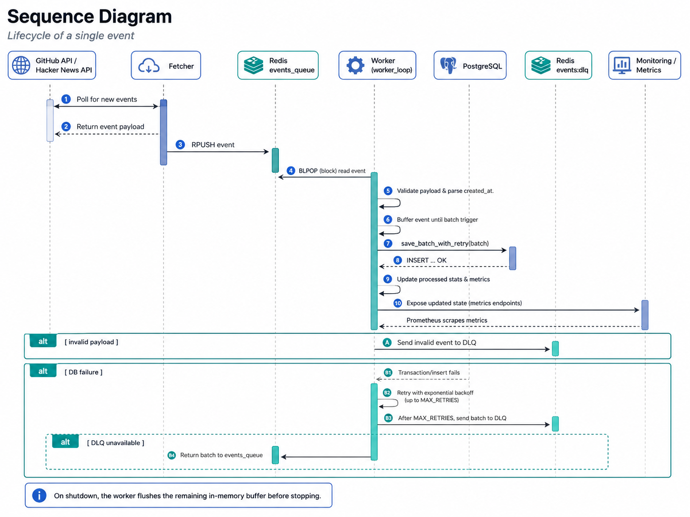
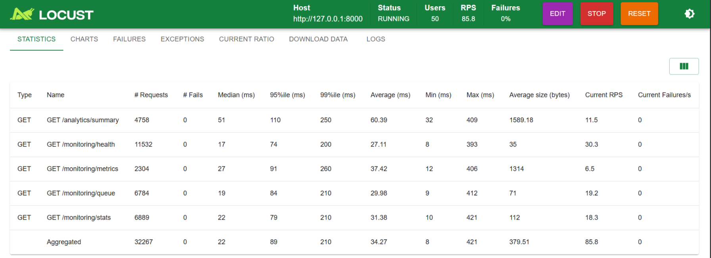
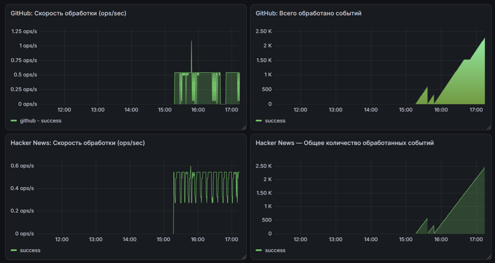

# Analytics Async Pipeline


Асинхронный сервис для сбора и обработки событий из GitHub и Hacker News.

Fetchers получают события из внешних API и отправляют их в Redis, воркеры обрабатывают очередь батчами и сохраняют данные в PostgreSQL, а состояние системы можно смотреть через API, Prometheus и Grafana.

## Возможности

- сбор событий из GitHub API и Hacker News API;
- асинхронная очередь Redis;
- несколько параллельных воркеров;
- пакетная запись событий в PostgreSQL;
- повторные попытки при ошибках базы данных;
- Dead Letter Queue для проблемных событий;
- корректное завершение воркеров без потери буфера;
- метрики Prometheus и дашборды Grafana;
- нагрузочное тестирование через Locust;
- запуск всего проекта через Docker Compose.

## Архитектура

Основной поток данных выглядит так:

```text
GitHub / Hacker News
          ↓
       Fetchers
          ↓
   Redis events_queue
          ↓
        Workers
          ↓
     PostgreSQL
```

При ошибках события отправляются в отдельную очередь `events:dlq`.



## Поток обработки данных

1. Fetchers запрашивают новые события из GitHub и Hacker News.
2. Полученные данные приводятся к общему формату.
3. События добавляются в Redis через `RPUSH`.
4. Воркеры получают их через `BLPOP`.
5. События проверяются и собираются в батч.
6. Батч сохраняется в PostgreSQL.
7. После успешной записи обновляются статистика и метрики.
8. Некорректные события отправляются в DLQ.

Использование `RPUSH + BLPOP` сохраняет порядок FIFO.



## Почему выбрана такая архитектура

**Redis** используется как промежуточная очередь между загрузкой и обработкой событий. Fetchers и workers могут работать независимо друг от друга, а временный рост нагрузки не блокирует всё приложение.

**Batch insert** уменьшает количество отдельных запросов к PostgreSQL. Вместо записи каждого события отдельно воркер сохраняет сразу группу событий.

**Retry с увеличивающейся задержкой** помогает пережить временные проблемы с базой данных.

**Dead Letter Queue** хранит события, которые не удалось обработать. Это позволяет не терять их и позже отдельно разбирать причины ошибок.

**Prometheus и Grafana** используются для просмотра состояния очереди, скорости обработки, ошибок и активности воркеров.

## Развёртывание

Проект запускается через Docker Compose.

| Сервис | Назначение | Порт |
|---|---|---:|
| `app` | FastAPI, fetchers и workers | `8001` |
| `postgres_db` | PostgreSQL | `5433` |
| `redis` | Redis | `6380` |
| `prometheus` | Сбор метрик | `9090` |
| `grafana` | Просмотр метрик | `3000` |

Для приложения, PostgreSQL и Redis настроены healthcheck.



## Жизненный цикл события

Один из воркеров получает событие из Redis, проверяет данные и добавляет его во внутренний буфер.

Когда буфер достигает нужного размера или срабатывает таймаут, события записываются в PostgreSQL одним батчем.

При ошибке базы данных выполняется несколько повторных попыток. После исчерпания попыток батч отправляется в DLQ.

Во время остановки приложения воркер сначала обрабатывает оставшиеся в памяти события.



## Параметры обработки

| Параметр | Значение |
|---|---:|
| Количество воркеров | `3` |
| Размер батча | `100` |
| Таймаут батча | `5 секунд` |
| Максимум повторных попыток | `5` |
| Основная очередь | `events_queue` |
| Dead Letter Queue | `events:dlq` |
| Benchmark-событий | `100 000` |

Значения воркеров и подключений можно изменять через переменные окружения.

## Нагрузочное тестирование API

HTTP API проверялся через Locust с 50 одновременными пользователями.

Тест выполнялся локально против приложения, запущенного через Uvicorn.

| Метрика | Результат |
|---|---:|
| Одновременные пользователи | 50 |
| Всего HTTP-запросов | 32 267 |
| Ошибок | 0 |
| Успешных запросов | 100% |
| Средняя скорость | 85.8 RPS |
| Среднее время ответа | 34.27 ms |
| Медиана | 22 ms |
| P95 | 89 ms |
| P99 | 210 ms |
| Максимальное время ответа | 421 ms |



Эти показатели относятся к HTTP API. Скорость обработки событий самого пайплайна отдельно измеряется скриптом `benchmark.py`.

## Мониторинг

Grafana показывает скорость обработки и общее количество обработанных событий отдельно для GitHub и Hacker News.



Prometheus получает метрики из приложения и передаёт их в Grafana.

Основные метрики:

- количество обработанных событий;
- количество ошибок;
- повторные попытки;
- размер основной очереди;
- размер DLQ;
- количество активных воркеров;
- время обработки батчей.

## Используемые технологии

- Python 3.11
- FastAPI
- asyncio
- SQLAlchemy
- PostgreSQL
- Redis
- Prometheus
- Grafana
- Docker Compose
- pytest
- Locust

## Запуск через Docker

Создай локальный `.env` на основе примера:

```powershell
Copy-Item .env.example .env
```

В `.env` укажи пароли PostgreSQL и Grafana:

```dotenv
POSTGRES_PASSWORD=change_me
GRAFANA_ADMIN_PASSWORD=change_me
```

Запусти проект:

```powershell
docker compose up -d --build
```

Проверь состояние контейнеров:

```powershell
docker compose ps
```

Остановка:

```powershell
docker compose down
```

Данные PostgreSQL, Redis, Prometheus и Grafana сохраняются в Docker volumes.

## Полезные адреса

После запуска через Docker доступны:

| Сервис | Адрес |
|---|---|
| FastAPI | `http://localhost:8001` |
| Swagger | `http://localhost:8001/docs` |
| Healthcheck | `http://localhost:8001/health` |
| Prometheus | `http://localhost:9090` |
| Grafana | `http://localhost:3000` |

## Основные API-маршруты

| Метод | Маршрут | Описание |
|---|---|---|
| `GET` | `/health` | состояние приложения |
| `GET` | `/analytics/summary` | статистика событий |
| `GET` | `/monitoring/stats` | общая статистика обработки |
| `GET` | `/monitoring/workers` | статистика воркеров |
| `GET` | `/monitoring/queue` | состояние Redis-очередей |
| `GET` | `/monitoring/health` | проверка подключения к Redis |
| `GET` | `/fetchers/github/status` | состояние GitHub fetcher |
| `GET` | `/fetchers/github/hn/status` | состояние Hacker News fetcher |
| `POST` | `/fetchers/github/once` | один запрос к GitHub |
| `POST` | `/fetchers/github/hn/once` | один запрос к Hacker News |

Все маршруты можно посмотреть в Swagger:

```text
http://localhost:8001/docs
```

## Проверка очередей

Размер основной очереди:

```powershell
docker compose exec redis redis-cli LLEN events_queue
```

Размер DLQ:

```powershell
docker compose exec redis redis-cli LLEN events:dlq
```

## Тесты

Запуск автоматических тестов:

```powershell
pytest -q
```

Нагрузочный тест API:

```powershell
locust -f locustfile.py --host http://127.0.0.1:8000
```

После запуска интерфейс Locust будет доступен по адресу:

```text
http://127.0.0.1:8089
```

Тест производительности очереди и воркеров:

```powershell
python benchmark.py
```

Скрипт создаёт 100 000 событий, добавляет их в Redis и измеряет скорость полной обработки.

## Структура проекта

```text
app/
├── api/              # API-маршруты
├── consumers/        # воркеры и обработка очереди
├── core/             # настройки приложения
├── db/               # подключения к Redis и PostgreSQL
├── models/           # модели базы данных
├── repositories/     # работа с PostgreSQL
├── services/         # GitHub и Hacker News fetchers
├── main.py           # запуск FastAPI и фоновых задач
└── metrics.py        # метрики Prometheus

docs/
├── images/           # архитектурные схемы
└── screenshots/      # скриншоты Grafana и Locust

tests/                # автоматические тесты
prometheus/           # конфигурация Prometheus
benchmark.py          # тест обработки 100 000 событий
locustfile.py         # нагрузочный тест HTTP API
docker-compose.yml    # Docker-сервисы
Dockerfile            # образ приложения
```